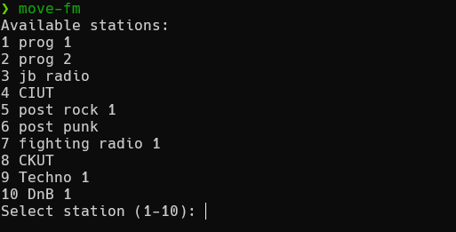

# Personal radio

This is just a way to save radio channel urls as I find 'em and to be able to play them via mpv.

To get this to work:
- Clone the repo
- Use my existing `stations.txt` file or add/edit as required (stations are entered as `name | url`)
- Install `mpv` (basically `sudo apt install mpv` but check out [mpv.io](https://mpv.io))
- Make the `move-fm.sh` script executable with `chmod +x /path/to/move-fm.sh`.
- Create a folder called `$HOME/.config/move-fm` (call it whatever you want, but make sure to change move-fm.sh to work with the new name). Specifically you need to edit move-fm.sh and edit the CONFIG_DIR variable to point to the folder you created.
- Create a symlink to the stations.txt file `ln -s "/absolute/path/to/stations.txt" ~/.config/move-fm/stations.txt` -> you MUST put the full path to the actual stations.txt file here to properly create a symlink
- Run `/path/to/move-fm.sh` and enjoy

Alternatively you could make it accessible globally:
- sudo ln -s `/absolute/path/to/move-fm.sh` `/usr/local/bin/move-fm`
- `sudo chmod +x /usr/local/bin/move-fm`
- run it with `move-fm` (or whatever you called it)

Running the script will bring up a menu that shows you what stations are available:

